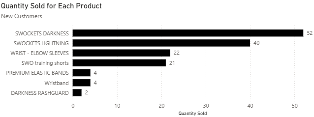
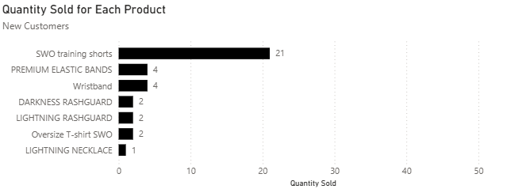
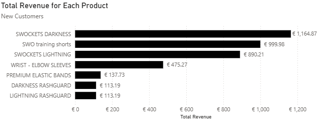
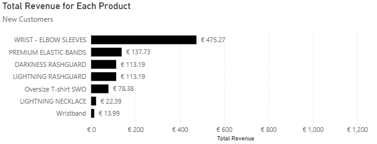
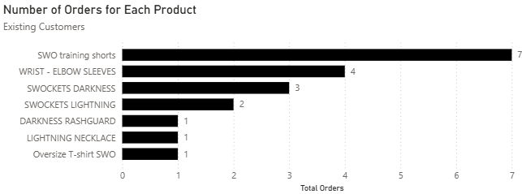
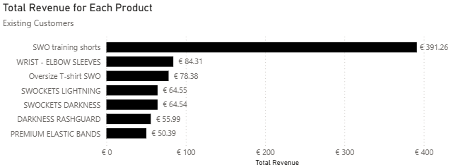
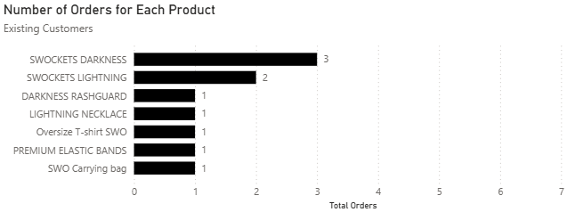
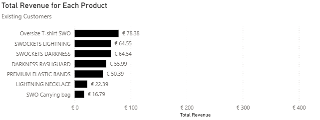

# Street Workout Official Summer Drop Analysis

## Project Background

Calisthenics is a brand of strength training done with one's own bodyweight. Street Workout Official (SWO), an e-commerce company, caters to calisthenics practitioners and professional athletes worldwide by selling sports apparel through its website. They also sponsor live competitions— providing clients with the opportunity to see the products SWO has in-person and make purchases.

International Strength Nights (ISN) is posed to be their biggest competition yet with the possibility of introducing more people to the brand, having important conversations with customers, and making sales through a limited-edition release.

Their summer drop in May 2025 consisted of a new release of white and black training shorts and wrist wraps/elbow sleeves. The transactions that occurred during this drop will be analysed to understand customer preferences to optimise sales at ISN.

Insights and recommendations will be provided on the following areas:
- **Monthly Sales**: an evaluation of trends in monthly net sales from January to June 2025 compared to 2024.
- **Product Performance**: an analysis of the products purchased during the summer drop with a focus on the average order value (AOV), quantity per order, and product purchase mixes. It will be split between new customers and existing customers.

## Executive Summary

### Main Findings
#### Monthly Sales
Net sales are higher and less variable in 2025 compared to the same period last year. The winter drop in November 2024 helped establish a consistent flow of clients, providing a reliable revenue stream not dependent on the outcome of releases.

#### Product Performance

The 4 most popular items were swockets (socks), wrist/elbow sleeves, and training shorts when it came to quantity sold and revenue amongst new customers. Out of these items, new customers would spend the most on orders with training shorts— purchasing multiple shorts along with other products in each order. For orders consisting of the other items, they spent considerably more than the price of the item because they would buy them with other SWO products. The most prominent case of this was with lightning (white) swockets with 85 percent of orders with it having other SWO products. The least popular items according to revenue generated were oversized T-Shirts, lightning necklaces, and wristbands. There were little orders for them and the products were mostly accompanied by the most popular ones.

For existing customers, it was a similar case with the most popular items being the same based on the number of orders. The AOV of each of them was primarily dictated by them being bought collectively rather than individually. The worst performing products by revenue were carrying bags and lightning necklaces which were either bought individually or with the best-selling products.

#### Recommendations

Based on these insights, SWO should cater to new customers by having a large supply of swockets, wrist/elbow sleeves, and training shorts — focusing more on swockets and less on lightning necklaces and wristbands. There is still potential for oversized T-Shirts to generate some revenue so bundling it with some of the most popular items could be beneficial. For existing customers, the focus should primarily be on supplying items from the latest drop — focusing on the training shorts due to its revenue generating potential and supplying less of carrying bags and lightning necklaces.

## Data Structure & Cleaning Process

This entity relational diagram shows tables that were derived from a Shopify orders export file that provides transactional information. It has an orders and product fact table and dimension tables which include: Order Details, Product Details, Customer Details, Unfulfilled Orders, Refunded Orders, and Date. The Orders Fact table is the central fact table linked to all the dimension tables and the Product Fact table is used to make product insights as the product names on Shopify differ from that on the Product Details table.

The SQL queries used to form the tables can be found <a href = "Data-Cleaning-Procedure/SQL_Queries">here</a>. Each of the tables made in SQL was exported to Power BI as a SQL Server query. This process was automated on SSIS. Here is the <a href = "Data-Cleaning-Procedure/SSIS_Automation_Process/SWO_automated_ETL.sln">solution</a>. The Product_Details table was made in Power BI. The table can be found <a href = "Data-Cleaning-Procedure/Product_Details.csv">here.</a> The Shopify orders exports file used in this analysis can be found <a href = "Data-Cleaning-Procedure/orders_export_1.csv">here</a>. The customer's names and addresses have been anonymised for privacy purposes. Finally the Power BI dashboard can be found <a href = "Data-Cleaning-Procedure/ISN preparation analysis_portfolio.pbix">here</a>.

## Insights
### Monthly Sales

These bar charts highlight the increase in SWO's net sales through a decrease in variability from 2024 to 2025. The sharp increase in the minimum value from 45 euros in 2024 to almost 700 euros in 2025 was a key factor in the almost 3 times increase in average monthly net sales. The product release in November 2024 helped capture lots of new customers and introduce a collection of products that are still attracting customers past its release. This provides a reliable revenue stream as the outcome of new drops can vary.

By learning about the products that attract the most customers, SWO can increase the margin of error of the limited-edition drop at ISN and make a substantial number of net sales.

### Product Performance

The metrics were calculated based on the net sales without outliers. The AOV was calculated using net sales instead of total revenue, which considered the impact of discounts and refunds. As a result, the impact of the goods that SWO gives away were accounted for.

#### New Customers

 
 

 
 

The most popular items by both the quantity sold and revenue were swockets, wrist/elbow sleeves and training shorts. Those 4 items made for around 90 percent of total revenue and quantity. Darkness and lightning swockets, SWO's first products, are still attracting new customers, but the new training shorts are also playing a role in bringing them in.

The worst performing products by revenue were wristbands, necklaces and oversized T-Shirts. However, by quantity, they were rashguards, necklaces, and oversized T-shirts. The inclusion of the rashguard is interesting as it generated the most revenue during the winter drop. This underscores the impact of seasonal fluctuations in  demand. Considering the revenue generating potential of rashguards, only wristbands, necklaces and oversized T-Shirts will be covered.

Here are some notes on the different products. Products bought mainly with others were likely not purchased intentionally.

- **Training Shorts**: orders with this product had the highest AOV of over 80 euros. The price of the item is the highest at 45 euros, positively skewing the AOV, but despite that, customers purchased more than just that item with around 70 percent of orders consisting of other items. A few of them bought multiple shorts as out of the 16 orders for the item, 6 of those consisted of both black and white shorts.
- **Swockets**: orders with lightning and darkness swockets had an AOV of almost 65 and 55 euros respectively. Lightning swockets were easily the best complementary item as almost 90 percent of orders with it contained other items. However, customers had the tendency to make more purchases of darkness swockets on their own with the proportion being the lowest of the most popular items at 60 percent. As a result, the AOV for darkness swockets was primarily dictated by customers buying it in multiples with there being 5 orders consisting of multiple darkness swockets and only 1 for lightning ones.
- **Wrist/Elbow sleeves**: orders with this product had an AOV of over 60 euros. The AOV was that high because people bought other items with it as 60 percent of orders for it came with other products and the quantity per order was a little higher than 1.
-	**Oversized T-Shirt**: there was only one order for it which consisted of multiple T-Shirts. The shirts were accompanied by swockets, new shorts, and wrist wraps— the 3 most popular items.
-	**Wristbands**: there were two orders for this item. One of them consisted of one wristband with lightning and darkness swockets, wrist/elbow sleeves, and shorts. The other one contained 3 wrist bands and darkness swockets.
-	**Necklaces**: there was only one order made for just that product, which generated under 25 euros— the lowest AOV out of all items ordered.

In general, 45 out of 46 orders made by new customers contained one of the four most popular items discussed. Most of the orders with the least most popular items were accompanied by the best-selling items. Considering the lack of demand for these products, there is not much need for them.

#### Existing Customers

There were only 13 orders purchased by this customer segment, so the total orders metric was used to assess the popularity of certain items instead of the quantity sold.

The 4 most popular items based on the number of orders matched that of new customers. Training shorts dominated when it came to both the number of orders and revenue and it is evident, but not surprising, that the top 2 products were the newest ones. Out of the 8 customers who bought wrist/elbow sleeves or training shorts, 6 of those customers had previously bought swockets. Observing the revenue, after training shorts, the items were in a similar range except lightning necklace and SWO carrying bag which were noticeably less.

For all the products, the AOV was mostly affected by the fact that they were bought with other products rather than the quantity ordered. Here are some other details:

- **Training Shorts**: 4 out of 7 orders came with other items.
- **Wrist/Elbow sleeves**: 3 out of 4 orders came with other items and those orders consisted of the other 3 items (training shorts, darkness and lightning swockets).
- **Swockets**: resembling the pattern with new customers, lightning swockets was evidently a good complementary item with all orders for it coming with other items. With the quantity per order for darkness swockets being 1, the AOV is still higher than the price of 20 euros due to the order that came with another item.
- **Lightning Necklaces**: there was only one order for this product, which included swockets (lightning and darkness), oversized T-shirts, and training shorts (white and black).
- **Carrying Bags**: there was one order for only item. This customer had made multiple orders previously consisting of swockets.

Generally, 11 out of 13 orders contained at least one of training shorts, wrist/elbow sleeves and swockets. The least performing products by revenue were the carrying bag and lightning necklace which either came alone or with the best-selling products.

#### Potential Revenue Lift Estimation
Here is a scenario to demonstrate the potential revenue lift that could occur at ISN if there was a higher stock of the items that were analysed. There are 100 customers, but after orders by 60 of them, the supply of all items gets depleted. This estimates the potential revenue uplift if there was still enough supply to satisfy the potential demand for the 40 customers. Out of them, 30 are new customers and 10 are existing ones. The 'Proportion of Orders with Item' is the number of orders for that item during the summer drop divided by the total orders made by each customer group. An assumption is that each customer can only make one order and behaviour in real life purchasing behaviouris consistent with that online. The 'Potential Orders Missed' is based on the number of customers in each segment assuming they made purchases matching the proportion of orders. It is purposely rounded down to be more conservative with the future estimates. The AOV excluding product considers both the product price and the product's quantity per order. The 'Potential Revenue Lift' is based on the AOV derived from orders with that product. This scenario assumes that each customer is limited to one order.

These are the metrics for new customers based on the scenario. They are based on the 46 online orders placed by them during the summer drop.
| Metric                               | Training shorts  | Wrist/elbow sleeves | Darkness Swockets | Lightning Swockets | Oversized T-Shirts | Wristbands | Necklaces |
|--------------------------------------|------------------|---------------------|-------------------|-------------------|-------------------|-------------|-----------|
| Proportion of Orders with Item       | 34.78%           | 41.30%              | **43.48%**        | 32.61%            | 2.17%             | 4.35%      | 2.17%     |
| Potential Orders Missed              | 10               | 12                  | **13**            | 9                 | 0                 | 1          | 0         |
| Average Quantity Per Order           | 1.31             | 1.16                | 2.6               | **2.67**          | 2                 | 2          | 1         |
| Average Order Value                  | €93.76           | €76.98              | €69.24            | €81.24            | **€187.16**       | €75.38     | €22.39    |
| Only individual purchases?           | No               | No                  | No                | No                | No                | No         | Yes       |
| Price of Product                     | **€44.74**       | €22.40              | €22.34            | €22.34            | €39.14            | €4.42      | €19.60     |
| Average Order Value excluding product| €35.15 (-62.51%) | €51.00 (-33.74%)    | **€11.16 (-83.88%)**  | €21.59 (-73.42%)  | €108.88 (-41.83%) | €66.54 (-11.73%)   | N/A       |
| Potential Revenue Lift               | **€937.60**      | €923.76             | €900.12            | €731.16           | €0.00             | €75.38     | €0.00     |
| Potential Revenue Generated Individually | €586.09      | €311.81             | **€754.54**        | €536.83           | €0.00             | €8.84      | €0.00     |

Darkness swockets had the highest number of potential orders missed with 13 of the 30 orders due to the high number of online orders. Its AOV also had the greatest decline after its exclusion at nearly 85 percent and the highest revenue generated individually at over 750 euros. This indicates customers had the tendency to buy darkness swockets individually rather than collectively. Wristbands had the lowest decline of only 12 percent and only 9 euros of potential revenue generated from those customers. This highlights the lack of importance of wristbands when it comes to revenue generation on an order-to-order basis. Despite the average order value of oversized T-shirts being the highest, the low proportion of orders with the item meant the potential revenue lift was 0 as out of 30 people it is not likely to be ordered compared to the other items. When it came to potential revenue lift, the training shorts had the highest value at nearly 940 euros. This is not surprising considering its AOV and number of orders. Lightning swockets were ranked lower than darkness swockets, wrist/elbow sleeves and training shorts when it came to individual revenue generation at almost 540 euros. This highlights the lack of popularity when it comes to number of orders for it specifically despite the AOV being the 3rd highest.

These are the metrics for existing customers based on the scenario. They are based on the 13 orders placed by them during the summer drop.
| Metric                               | Training shorts      | Wrist/elbow sleeves | Darkness Swockets | Lightning Swockets | Necklaces | Carrying Bags |
|--------------------------------------|----------------------|---------------------|-------------------|---------------------|-------------------|--------|
| Proportion of Orders with Item       | **53.85%**           | 30.77%              | 23.08%            | 15.38%              | 7.69%             | 7.69%  |
| Potential Orders Missed              | **5**                | 3                   | 2                 | 1                   | 0                 | 0      |
| Average Quantity Per Order           | 1.14                 | 1                   | 1                 | **1.5**             | 1                 | 1      |
| Average Order Value                  | €72.68               | €60.42              | €39.76            | €162.62             | **€248.73**       | €16.79 |
| Only individual purchases?           | No                   | No                  | No                | No                  | No                | Yes    |
| Price of Product                     | **€44.74**           | €22.40              | €22.34            | €22.34              | €19.60            | €11.14 |
| Average Order Value excluding product| **€21.68 (-70.17%)** | €38.02 (-37.07%)    | €17.42 (-56.19%)  | €129.11 (-25.95%)   | €229.13 (7.88%)   | N/A    |
| Potential Revenue Lift               | **€363.40**          | €181.26             | €79.52            | €162.62             | €0.00             | €0.00  |
| Potential Revenue Generated Individually | **€255.02**      | €67.20              | €44.68            | €33.51              | €0.00             | €0.00  |

Due to the large demand by existing customers for the new training shorts during the summer drop, it had the greatest potential orders missed at 5 out of 10. As a result of its relatively high price and number of orders, it also had the largest AOV percent decrease, potential revenue lift, and potential revenue generated individually. With only 8 percent of orders online being for necklaces and carrying bags, they had a potential orders missed measure of 0. Out of the most popular items, lightning swockets had the lowest percent decrease in AOV at 26 percent and darkness swockets had the 2nd highest at 56 percent. This underscores the complementary nature of the lightning swockets and that customers still demand swockets darkness specifically. This might not be for the best for darkness swockets as with many existing customers already having swockets, the lack of demand for the product led to it having the lowest potential revenue lift out of those 4 items.

## Recommendations
In order to generate the most demand and increase sales, SWO would need to have swockets available to attract new customers. Many customers look out for darkness swockets specifically as indicated and some of them buy lightning swockets with other goods. SWO would need less necklaces, wristbands and carrying bags due to the lack of demand by both new and existing customers. Even though oversized T-Shirts were not popular with new customers, they could still be included in a bundle with darkness swockets and some of the most popular items due to its revenue generating potential. With the high likelihood that many people at ISN will be existing customers, there would need to be a larger share of shorts and wrist/elbow sleeves available.
