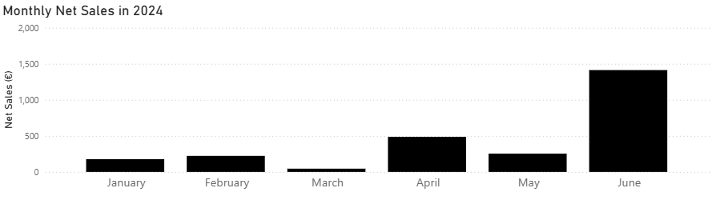
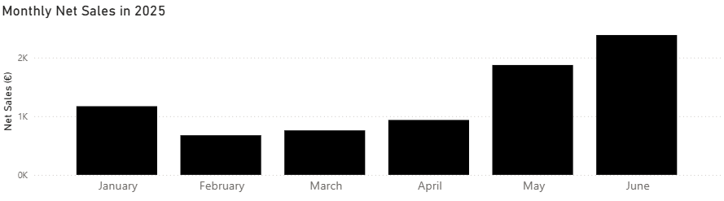
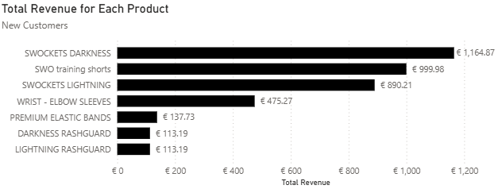
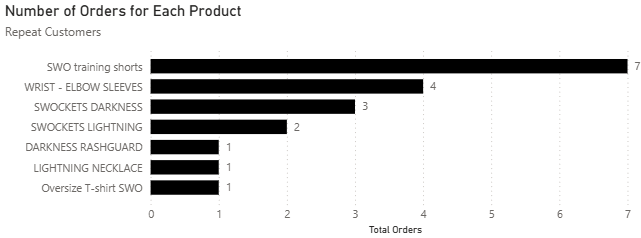
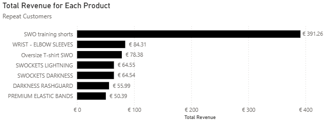

# Street Workout Official Summer Drop Analysis

## Project Background
Calisthenics is a brand of strength training done with one's own bodyweight. Street Workout Official (SWO), an e-commerce company, caters to calisthenics practitioners and professional athletes worldwide by selling sports apparel through its website. They also sponsor various live competitions— providing clients the opportunity to see the products SWO has in-person and make purchases.

The company's growth in the past year has allowed there to be enough transactional data to fully implement a data analytics initiative. International Strength Nights (ISN) is posed to be their biggest competition yet with the possibility of introducing more people to the brand, having important conversations with existing customers, and making sales through a limited-edition release. 

Their summer drop in May 2025 consisted of a new release of white and black training shorts and wrist wraps/elbow sleeves. The transactions that occurred during this drop will be analysed to understand customer preferences and optimise sales. 

Insights and recommendations will be provided on the following areas:
- **Monthly Sales**: an evaluation of patterns in monthly sales and order frequency from January to June in comparison to last year.
- **Product Performance**: an analysis of the different products released during the summer drop with a focus on the average order value (AOV), quantity per order, and product combinations. This will be split between new customers and existing customers. Existing customers is defined as customers who purchased SWO products before and after the summer release. 

## Executive Summary

### Main Findings
#### Monthly Sales
Net sales are higher and less variable in 2025 compared to the same period the previous year with the value slowly increasing after February. The winter drop in November 2024 helped establish a consistent flow of clients, providing a reliable revenue stream not dependent on the outcome of releases.

#### Product Performance
The 4 most popular items were SWOCKETS (socks), wrist/elbow sleeves, and training shorts for new customers. Those were the highest-ranked items when it came to quantity sold and revenue. Out of these items, new customers would spend the most on orders with training shorts. For the other items, they spent a fair amount relative to the price of the item due to them buying those items with other SWO products. The most prominent case of this was with the lightning (white) SWOCKETS with the least being with darkness (black) SWOCKETS. The least popular items were the oversized T-Shirt, lightning necklaces, and wristbands when observing revenue generated. These items had very few orders for them and they were mostly accompanied by the most popular items.

For existing customers, it was a similar case with the top 4 items that customers ordered being the same based on number of orders. The AOV was dictated by the fact that those items were bought collectively rather than separately with a large proportion of orders consisting of those 4 items. The worst performing products by revenue were carrying bags and lightning necklaces which were either bought individually or with the most top 4 products.

#### Recommendations
Based on these insights SWO should cater to new customers by having a large supply of SWOCKETS, wrist/elbow sleeves, and training shorts, with a great focus on the SWOCKETS and a lesser focus on oversized T-Shirts, lightning necklaces and wristbands. For repeat customers the focus should primarily be on supplying items from the newest, focusing on the training shorts due to its revenue generating potential and supplying less of carrying bags and lightning necklaces.

## Data Structure & Cleaning Process
This entity-relational-diagram shows tables that were derived from a Shopify orders export file that provides transactional information. It has an orders and product fact table and dimension tables consisting of: Order Details, Product Details, Customer Details, Unfulfilled Orders, Refunded Orders, and Date. Orders fact is the central fact table and product fact is a table used to be able to make certain product insights as the product names on Shopify differ from the names SWO provides. 
 

The SQL queries used to form the tables can be found <a href = "Data-Cleaning-Procedure/SQL_Queries">here</a>. The Product_Details table was made in Power BI. The table can be found <a href = "Data-Cleaning-Procedure/Product_Details.csv">here.</a> The Shopify orders exports file used in this analysis can be found <a href = "Data-Cleaning-Procedure/orders_export_1.csv">here</a>. The customer's names and addresses have been anonymised for privacy purposes. Finally the Power BI dashboard can be found <a href = "Data-Cleaning-Procedure/ISN preparation analysis_portfolio.pbix">here</a>.

## Insights
### Monthly Sales

These bar charts highlight the increase in SWO'S net sales through a decrease in variability from 2024 to 2025. The sharp increase in the minimum value from 45 euros in 2024 to almost 700 euros in 2025 was a key factor in the almost 3 times increase in average monthly net sales. The product release in the winter of 2024 worked to capture lots of new customers and introduce a collection of products that are still attracting customers past its release. This provides a reliable revenue stream as the outcome of new drops can vary.
 
 
By learning about the products that attract the most customers, SWO can increase the margin of error of the new drop at ISN and make a substantial number of net sales.

### Product Performance
The metrics were calculated based on the net sale values without outliers. The AOV was calculated using net sales instead of total revenue because it takes discounts and refunds into account. Through this method, the impact of the goods that SWO gives away can be analysed.

#### New Customers

The most popular items by when observing both the quantity sold and revenue were the socks, wrist/elbow sleeves and training shorts. Those 4 items made for around 90 percent of all items sold and revenue. Darkness and lightning SWOCKETS were released at SWO's inception and they are still what attracts new customers, but the new training shorts is also playing a role in bringing them in. 

The worst performing products by revenue were the wristbands, necklaces and oversized T-Shirts. However, based on quantity, they were the rashguards, necklace, and oversized T-shirt. The inlcusion of rashguards is interesting as it was the best-selling item based on revenue during the winter drop. This highlights the impact of seasonal fluctuations in the demand. Considering the revenue generating potential, only wristbands, necklaces and oversized T-Shirts will be covered.

Here are some notes on the different products. It is assumed that products that are primarily bought with other products are not demanded specifically compared to products that are more frequently bought by themselves.
 

- **Training Shorts**: orders with this product had the highest AOV of over 80 euros. The price of the item is the highest at 45 euros, positively skewing the AOV, but despite that, people are purchasing more than just that item with around 70 percent of orders consisting of other items. A few customers bought multiple shorts. Out of the 16 orders, 6 of those consisted of both black and white shorts.
- **SWOCKETS**: Orders with lightning and darkness SWOCKETS had an AOV of almost 65 euros and 55 euros respectively. Lightning SWOCKETS were easily the best complementary item as almost 90 percent of orders with that product contained other items. However, customers had the tendency to make more purchases of darkness SWOCKETS on their own as the proportion is the lowest at 60 percent. People had a higher tendency to buy multiple darkness SWOCKETS than lightning SWOCKETS with there being 5 orders with multiple darkness SWOCKETS and only 1 with lightning SWOCKETS.
- **Wrist/Elbow sleeves**: orders with this product had an AOV of over 60 euros. The AOV being that high was due to people buying other items as 60 percent of orders with this item came with other products and the quantity per item was a little higher than 1.
-	**Oversized T-Shirt**: there was only one order for it with the customer ordering multiple T-Shirts. The order was accompanied by SWOCKETS, new shorts, and wrist wraps— the 3 most popular items during the summer drop.
-	**Wristbands**: there were two orders for this item. One of the orders consisted of one wristband with lightning and darkness SWOCKETS, wrist wraps, and shorts. The other order contained 3 wrist bands and darkness SWOCKETS.
-	**Necklaces**: there was only one order made for the product alone, which generated under 25 euros, a low amount of net sales compared with the best selling items.

In general, 45 out of 46 orders made by new customers contained one of the four most popular items discussed. Most of the orders with the least most popular items were primarily accompanied by the best-selling items. With the lack of demand for thse products there is not much need for them. 

 

#### Existing Customers
There were only 13 orders purchased by this customer segment so the total orders metric was used to assess the popularity of certain items instead of the quantity.
 

 
The 4 most popular items based on the number of orders were the same as that of new customers. Training shorts dominated when it came to both the number of orders and revenue and it is notable that the top 2 products based on number of orders were for newer products. Out of the 8 customers who bought wrist/elbow sleeves or training shorts, 6 of those customers had previously bought SWOCKETS. When it comes to number of orders, all the orders that were less than lightning SWOCKETS had only one order for the respective products. Observing the revenue, after training shorts, the items were in a similar range except lightning necklace and SWO carrying bag which were notably less.

For all the products, the AOV was dictated by the fact that it being bought with different products. Here are some other details:

- **Training Shorts**: 4 out of 7 orders came with other items.
- **Wrist/Elbow sleeves**: 3 out of 4 orders came with other items and all the orders with other items consisted of the other 3 items (training shorts, darkness and lightning SWOCKETS.
- **SWOCKETS**: Resembling the pattern with new customers, lightning SWOCKETS was evidently a good complementary item with all orders for it coming with other items. With the quantity per order for darkness SWOCKETS being 1, the AOV is still higher than the price of 20 euros because the net sales of the only order with another item was 67.50 euros.
- **Lightning Necklaces**: there was only one order for this product, which included SWOCKETS (lightning and darkness), oversized T-shirts, and training shorts (white and black).
- **Carrying Bags**: there was one order for that item specifically, which consisted of only that bag. This customer had made multiple orders previously consisting of SWOCKETS.

Generally, 11 out of 13 orders contained at least one of those 4 items. The worst performing products by revenue was carrying bag and lightning necklace which either came alone or with the best-selling products.

#### Potential Revenue Lift Estimation
Here is a scenario to estimate of the potential revenue lift that could occur at ISN if there was a higher stock of the items that were analysed. There are 100 SWO customers at ISN, but after 60 orders, the product sells out. It estimates the potential revenue uplift if there was still enough supply to satisfy the potential demand for the 40 customers. Out of those 40 customers, 30 are new customers and 10 of them are existing customers. The 'Proportion of Orders with Item' is the number of orders for that item divided by the total orders made by each customer group. The 'Potential Orders Missed' metric is based on the number of customers in each segment if they had made purchases based on the proportion of orders, and is purposely round down to be more conservative with the future estimates. The 'Potential Revenue Lift' is based on the AOV of orders with that product.

These are the metrics for new customers based on the scenario. They are based on the 46 online orders placed by them during the summer drop.
| Metric                               | Training shorts  | Wrist/elbow sleeves | Darkness SWOCKETS | Lightning SWOCKETS | Oversized T-Shirts | Wristbands | Necklaces |
|--------------------------------------|------------------|---------------------|-------------------|-------------------|-------------------|-------------|-----------|
| Proportion of Orders with Item       | 34.78%           | 41.30%              | **43.48%**        | 32.61%            | 2.17%             | 4.35%      | 2.17%     |
| Potential Orders Missed              | 10               | 12                  | **13**            | 9                 | 0                 | 1          | 0         |
| Average Quantity Per Order           | 1.31             | 1.16                | 2.6               | **2.67**          | 2                 | 2          | 1         |
| Average Order Value                  | €93.76           | €76.98              | €69.24            | €81.24            | **€187.16**       | €75.38     | €22.39    |
| Only individual purchases?           | No               | No                  | No                | No                | No                | No         | Yes       |
| Average Order Value excluding product| €35.15 (-62.51%) | €51.00 (-33.74%)    | **€11.16 (-83.88%)**  | €21.59 (-73.42%)  | €108.88 (-41.83%) | €66.54 (-11.73%)   | N/A       |
| Potential Revenue Lift               | **€937.60**     | €923.76             | €900.12            | €731.16           | €0.00             | €75.38     | €0.00     |
| Potential Revenue Generated with Product | €586.09     | €311.81             | **€754.54**        | €536.83           | €0.00             | €8.84      | €0.00     |

Due to the high number of orders online for darkness SWOCKETS, it had the highest number of potential orders missed with 13 of the 30 new customers. Despite the average order value of oversized T-Shirts being the highest, the low proportion of orders with the item meant the potential revenue lift was 0. The AOV of orders with darkness SWOCKETS had the greatest decline when the product was excluded and the greatest decline of nearly 85 percent. It also had the highest revenue generated with the product at over 750 euros. This highlights the consumer behaviour as many customers are buying darkness SWOCKETS individually. Wristbands had the lowest decline of only 12 percent and only 9 euros of potential revenue generated from those customers. This highlights the lack of importance when it comes to revenue generation on an order-to-order basis. When it came to potential revenue lift, the training shorts had the highest value at nearly 940 euros. This is not surprising considering its AOV and number of orders. The lightning SWOCKETS are ranked at a lower level than the likes of darkness SWOCKETS, wrist/elbow sleeves and training shorts with a revenue lift of almost 540 euros. This highlights the lack of popularity when compared to those products despite the AOV with the item being the 3rd highest. 

These are the metrics for existing customers based on the scenario. They are based on the 13 orders placed by them during the summer drop.
| Metric                               | Training shorts      | Wrist/elbow sleeves | Darkness SWOCKETS | Lightning SWOCKETS | Necklaces | Carrying Bags |
|--------------------------------------|----------------------|---------------------|-------------------|---------------------|-------------------|--------|
| Proportion of Orders with Item       | **53.85%**           | 30.77%              | 23.08%            | 15.38%              | 7.69%             | 7.69%  |
| Potential Orders Missed              | **5**                | 3                   | 2                 | 1                   | 0                 | 0      |
| Average Quantity Per Order           | 1.14                 | 1                   | 1                 | **1.5**             | 1                 | 1      |
| Average Order Value                  | €72.68               | €60.42              | €39.76            | €162.62             | **€248.73**       | €16.79 |
| Only individual purchases?           | No                   | No                  | No                | No                  | No                | Yes    |
| Average Order Value excluding product| **€21.68 (-70.17%)** | €38.02 (-37.07%)    | €17.42 (-56.19%)  | €129.11 (-25.95%)   | €229.13 (7.88%)   | N/A    |
| Potential Revenue Lift               | **€363.40**          | €181.26             | €79.52            | €162.62             | €0.00             | €0.00  |
| Potential Revenue Generated with Product | **€255.02**      | €67.20              | €44.68            | €33.51              | €0.00             | €0.00  |

Due to the large demand by customers for the new training shorts based on the number of online orders, it has the greatest potential for orders with 5 orders out of 10. It also has the largest AOV percent decrease, potential revenue lift, and potential revenue generated. Its relatively high price and number of orders have a massive part to play in it having a high potential revenue lift and revenue generated. With only 7.69 percent of orders online being for necklaces and carrying bags, they had a potential orders missed measure of 0. Out of the orders, the order with a necklace had the lowest decrease in AOV with a decrease of only 8 percent. This is due to its low order quantity at just 1. Out of the most popular items, lightning SWOCKETS had the lowest percent decrease in AOV at 26 percent and darkness SWOCKETS had the 2nd highest at 56 percent. This underscores the complementary nature of the lightning SWOCKETS and that customers still demand SWOCKETS darkness specifically. For darkness SWOCKETS, this might not be for the best as with many existing customers already having SWOCKETS, the lack of demand for the product led to it having the lowest potential revenue lift out of tose 4 items.

## Recommendations
In order to generate the most demand and increase sales, SWO would need to have shorts, SWOCKETS, and wrist wraps/elbow sleeves available with a great focus on both darkness SWOCKETS and lightning SWOCKETS to attract new customers and less of necklaces, oversized T-Shirts, wristbands and carrying bags. Many customers look out for darkness SWOCKETS specifically as indicated and some of them buy lightning SWOCKETS with other goods. With the high likelihood that most people at ISN will be existing customers, there would need to be a larger share of shorts available due to its immense revenue generating potential.
